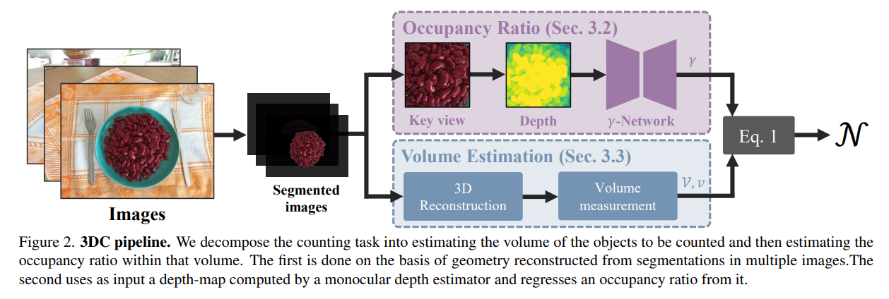

# 3DC



## 1. Introduction

<!-- [ALGORITHM] -->

```BibTeX
@inproceedings{dumery2025counting,
   title = {{Counting Stacked Objects}},
   author = {Dumery, Corentin and Ett{\'e}, Noa and Fan, Aoxiang and Li, Ren and Xu, Jingyi and Le, Hieu and Fua, Pascal},
   booktitle = {Proceedings of the IEEE/CVF International Conference on Computer Vision},
   year = {2025}
}
```

## 2. To install the environment, run the following script:
```shell
bash scripts/install.sh
```

## 3. To download pretrained weights, run the following script:
```shell
bash scripts/download_weights.sh
```

## 4. To test the model for the StackCounting dataset, run the following script:
```shell
bash scripts/test.sh
```

## 5. Acknowledgement
* [CorentinDumery/3d-counting](https://github.com/CorentinDumery/3d-counting)
