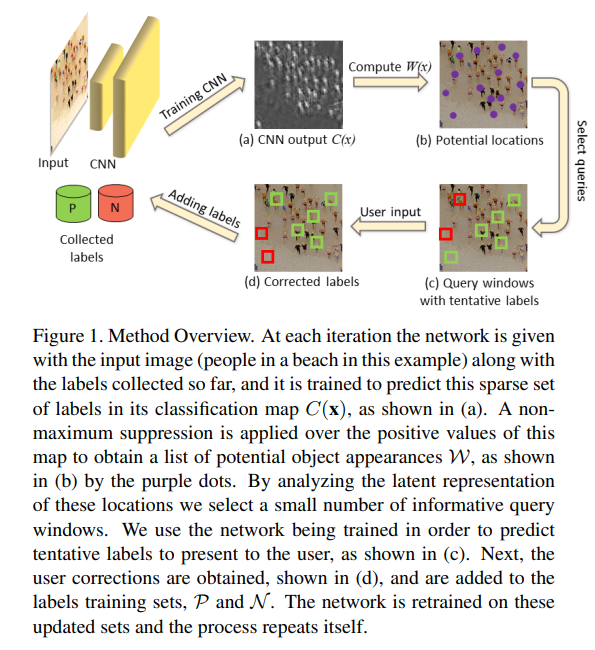

# Count_AL



## 1. Introduction

<!-- [ALGORITHM] -->

```BibTeX
@inproceedings{huberman2022single,
  title={Single image object counting and localizing using active-learning},
  author={Huberman-Spiegelglas, Inbar and Fattal, Raanan},
  booktitle={Proceedings of the IEEE/CVF Winter Conference on Applications of Computer Vision},
  pages={1310--1319},
  year={2022}
}
```

## 2. To train and test the model for the SIC dataset, run the following script:
```shell
bash scripts/train_sic.sh
```

## 3. Acknowledgement
* [inbarhub/Single-Image-Object-Counting-and-Localizing-using-Active-Learning](https://github.com/inbarhub/Single-Image-Object-Counting-and-Localizing-using-Active-Learning)
