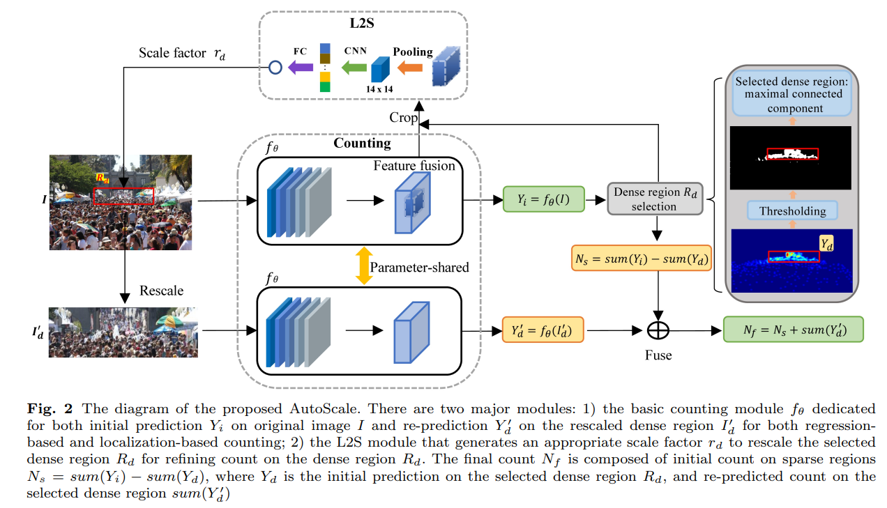

# AutoScale



## 1. Introduction

<!-- [ALGORITHM] -->

```BibTeX
@article{autoscale,
  title={AutoScale: Learning to Scale for Crowd Counting},
  author={Xu, Chenfeng and Liang, Dingkang and Xu, Yongchao and Bai, Song and Zhan, Wei and Tomizuka, Masayoshi and Bai, Xiang},
  journal={Int J Comput Vis},
  year={2022}
}
```

## 2. To process the dataset, run the following script:
```shell
bash scripts/process_dataset.sh
```

## 3. To test the model for ShanghaiTech, UCF-QNRF, JHU-Crowd++, and NWPU-Crowd datasets, run the following scripts:
```shell
bash scripts/test_sha.sh
bash scripts/test_shb.sh
bash scripts/test_qnrf.sh
bash scripts/test_jhu.sh
bash scripts/test_nwpu.sh
```

## 4. Acknowledgement
* [dk-liang/AutoScale_regression](https://github.com/dk-liang/AutoScale_regression)
