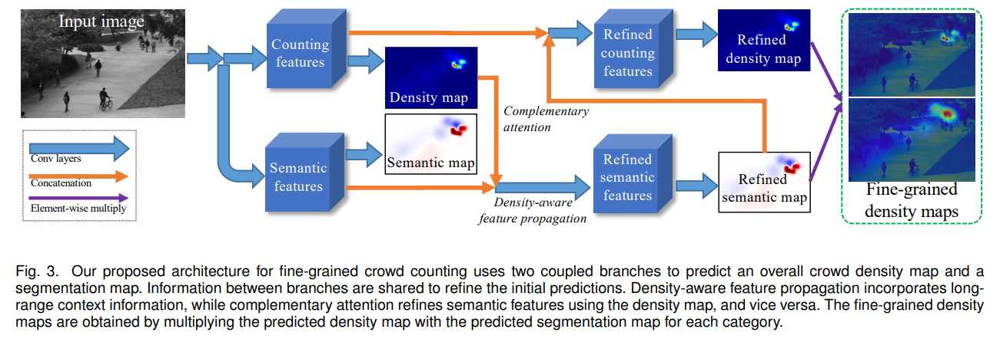

# FGCC



## 1. Introduction

<!-- [ALGORITHM] -->

```BibTeX
@article{wan2021fine,
    title={Fine-grained crowd counting},
    author={Wan, Jia and Kumar, Nikil Senthil and Chan, Antoni B},
    journal={IEEE transactions on image processing},
    volume={30},
    pages={2114--2126},
    year={2021},
}
```

## 2. To train and test the model for the Torwards-vs-Away dataset, run the following scripts:
```shell
bash scripts/train_towards_vs_away.sh
bash scripts/test_towards_vs_away.sh
```

## 3. Acknowledgement
* [rk620/Fine-Grained-CrowdCounting](https://github.com/rk620/Fine-Grained-CrowdCounting)
