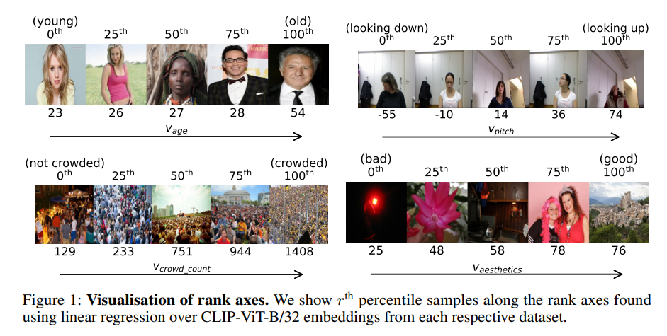

# RankBench



## 1. Introduction

<!-- [ALGORITHM] -->

```BibTeX
@article{sonthalia2025rankability,
  title={On the Rankability of Visual Embeddings},
  author={Ankit Sonthalia and Arnas Uselis and Seong Joon Oh},
  journal={arXiv preprint arXiv:2507.03683},
  year={2025}
}
```

## 2. To install the environment, run the following script:
```shell
bash scripts/install.sh
```

## 3. To tes the model for ShanghaiTech and UCF-QNRF datasets, run the following script:
```shell
bash scripts/test.sh
```

## 4. Acknowledgement
* [aktsonthalia/rankable-vision-embeddings](https://github.com/aktsonthalia/rankable-vision-embeddings)
