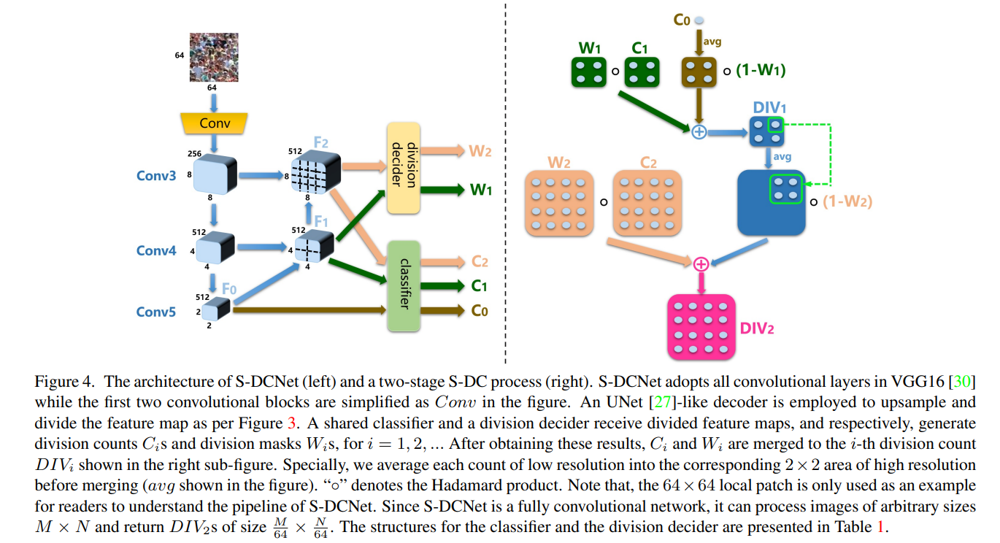

# S-DCNet



## 1. Introduction

<!-- [ALGORITHM] -->

```BibTeX
@inproceedings{xhp2019SDCNet,
  title={From Open Set to Closed Set: Counting Objects by Spatial Divide-and-Conquer},
  author={Xiong, Haipeng and Lu, Hao and Liu, Chengxin and Liang, Liu and Cao, Zhiguo and Shen, Chunhua},
  booktitle={Proceedings of the IEEE/CVF International Conference on Computer Vision (ICCV)},
  year={2019},
  pages = {8362-8371}
}
```

## 2. To download weights, run the following script:
```shell
bash scripts/download_weights.sh
```

## 3. To test the model for the ShanghaiTech dataset, run the following script:
```shell
bash scripts/test.sh
```

## 4. Acknowledgement
* [xhp-hust-2018-2011/S-DCNet](https://github.com/xhp-hust-2018-2011/S-DCNet)
