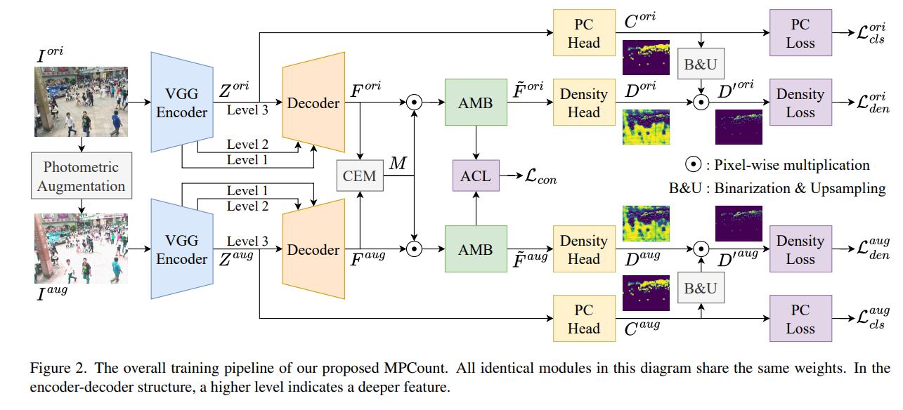

# MPCount



## 1. Introduction

<!-- [ALGORITHM] -->

```BibTeX
@inproceedings{pengMPCount2024,
  title = {Single Domain Generalization for Crowd Counting},
  booktitle = {Proceedings of the IEEE/CVF Conference on Computer Vision and Pattern Recognition (CVPR 2024)},
  author = {Peng, Zhuoxuan and Chan, S.-H. Gary},
  year = {2024}
}
```

## 2. To process the dataset, run the following script:
```shell
bash scripts/process_dataset.sh
```

## 3. To download weights, run the following script:
```shell
bash scripts/download_weights.sh
```

## 4. To train, test, and visualize the model for ShanghaiTech, UCF-QNRF, and NWPU-Crowd datasets, run the following scripts:
```shell
bash scripts/train_sta.sh
bash scripts/train_stb.sh
bash scripts/train_nwpu.sh
bash scripts/test_sta.sh
bash scripts/test_stb.sh
bash scripts/test_nwpu.sh
bash scripts/vis_sta.sh
bash scripts/vis_stb.sh
bash scripts/vis_nwpu.sh
```

## 5. To infer the model for an image, run the following script:
```shell
bash scripts/infer.sh
```

## 6. Acknowledgement
* [Shimmer93/MPCount](https://github.com/Shimmer93/MPCount)
