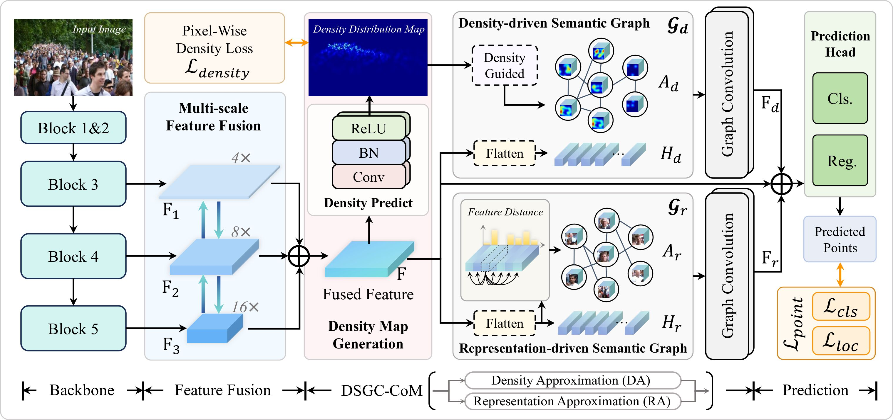

# DSGCNet



## 1. Introduction

<!-- [ALGORITHM] -->

```BibTeX
@article{wu2025dsgc,
  title={DSGC-Net: A Dual-Stream Graph Convolutional Network for Crowd Counting via Feature Correlation Mining},
  author={Wu, Yihong and Wei, Jinqiao and Zhao, Xionghui and Li, Yidi and Du, Shaoyi and Ren, Bin and Sebe, Nicu},
  journal={arXiv preprint arXiv:2509.02261},
  year={2025}
}
```

## 2. To process the dataset, run the following script:
```shell
bash scripts/process_dataset.sh
```

## 3. To train and test the model for the ShanghaiTech dataset, run the following scripts:
```shell
bash scripts/train_sha.sh
bash scripts/train_shb.sh
bash scripts/test_sha.sh
bash scripts/test_shb.sh
```

## 4. Acknowledgement
* [Wu-eon/CrowdCounting-DSGCNet](https://github.com/Wu-eon/CrowdCounting-DSGCNet)
