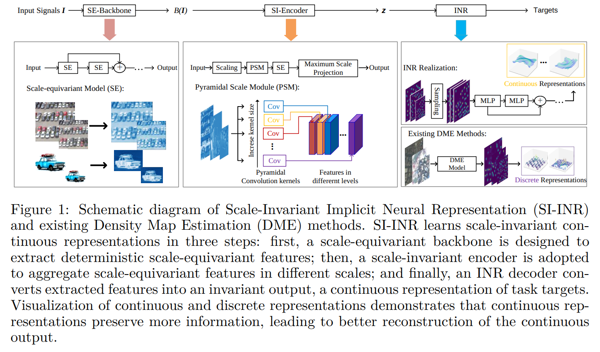

# SI-INR



## 1. Introduction

<!-- [ALGORITHM] -->

```BibTeX
@article{xuscale,
  title={Scale-Invariant Continuous Implicit Neural Representations For Object Counting},
  author={Xu, Siyuan and Wang, Yucheng and Luo, Xihaier and Yoon, Byung-Jun and Qian, Xiaoning}
}
```

## 2. To process the dataset, run the following script:
```shell
bash scripts/process_dataset.sh
```

## 3. To train and test the model for the ShanghaiTech dataset, run the following scripts:
```shell
bash scripts/train_sha.sh
bash scripts/train_shb.sh
```

## 4. Acknowledgement
* [forum?id=9swCsnoNX4](https://openreview.net/forum?id=9swCsnoNX4)
