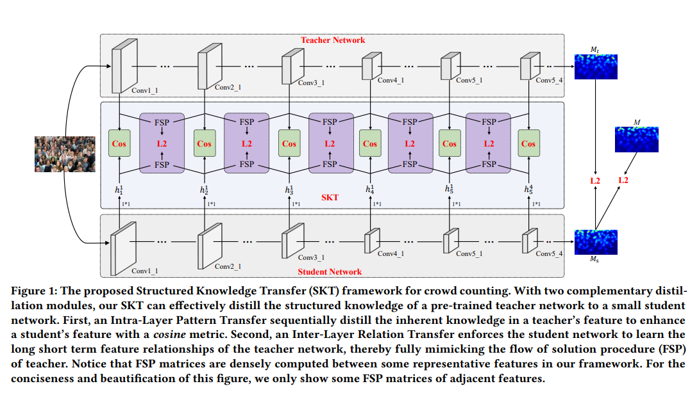

# SKT



## 1. Introduction

<!-- [ALGORITHM] -->

```BibTeX
@inproceedings{liu2020efficient,
  title={Efficient Crowd Counting via Structured Knowledge Transfer},
  author={Liu, Lingbo and Chen, Jiaqi and Wu, Hefeng and Chen, Tianshui and Li, Guanbin and Lin, Liang},
  booktitle={ACM International Conference on Multimedia},
  year={2020}
}
```

## 2. To process the dataset, run the following script:
```shell
bash scripts/process_dataset.sh
```

## 3. To train and test the model for ShanghaiTech and UCF-QNRF datasets, run the following scripts:
```shell
bash scripts/train_sha.sh
bash scripts/train_shb.sh
bash scripts/train_qnrf.sh
bash scripts/test_sha.sh
bash scripts/test_shb.sh
bash scripts/test_qnrf.sh
```

## 4. Acknowledgement
* [chen-judge/SKT](https://github.com/chen-judge/SKT)
