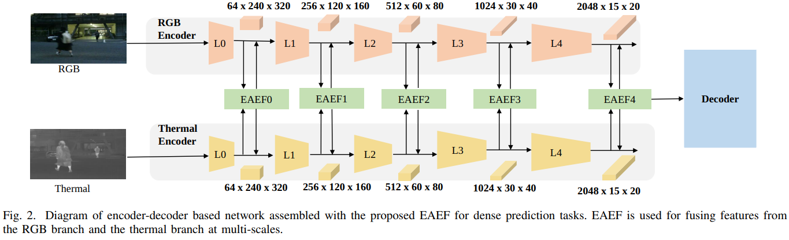

# EAEFNet



## 1. Introduction

<!-- [ALGORITHM] -->

```BibTeX
@article{liang2023explicit,
  title={Explicit attention-enhanced fusion for RGB-thermal perception tasks},
  author={Liang, Mingjian and Hu, Junjie and Bao, Chenyu and Feng, Hua and Deng, Fuqin and Lam, Tin Lun},
  journal={IEEE Robotics and Automation Letters},
  volume={8},
  number={7},
  pages={4060--4067},
  year={2023},
  publisher={IEEE}
}
```

## 2. To process the dataset, run the following script:
```shell
bash scripts/process_dataset.sh
```

## 3. To train and test the model for the RGBT-CC dataset, run the following scripts:
```shell
bash scripts/train_rgbt_cc.sh
bash scripts/test_rgbt_cc.sh
```

## 4. Acknowledgement
* [FreeformRobotics/EAEFNet](https://github.com/FreeformRobotics/EAEFNet)
