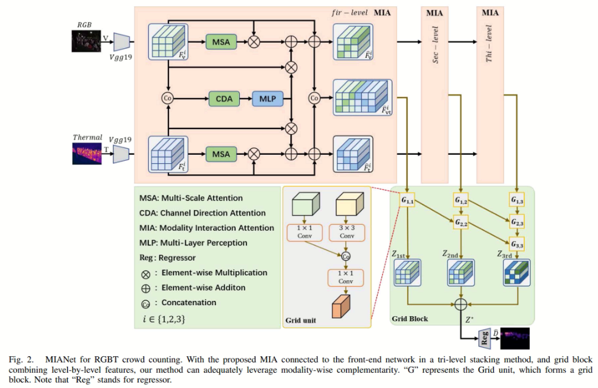

# MIANet



## 1. Introduction

<!-- [ALGORITHM] -->

```BibTeX
@article{wang2024mianet,
  title={MIANet: Bridging the Gap in Crowd Density Estimation With Thermal and RGB Interaction},
  author={Wang, Shuyu and Wu, Weiwei and Li, Yinglin and Xu, Yuhang and Lyu, Yan},
  journal={IEEE Transactions on Intelligent Transportation Systems},
  volume={26},
  number={1},
  pages={254--267},
  year={2024},
  publisher={IEEE}
}
```

## 2. To process the dataset, run the following script:
```shell
bash scripts/process_dataset.sh
```

## 3. To train and test the model for the RGBT-CC dataset, run the following scripts:
```shell
bash scripts/train_rgbt_cc.sh
bash scripts/test_rgbt_cc.sh
```

## 4. Acknowledgement
* [sawyerseu/MIANet](https://github.com/sawyerseu/MIANet)
