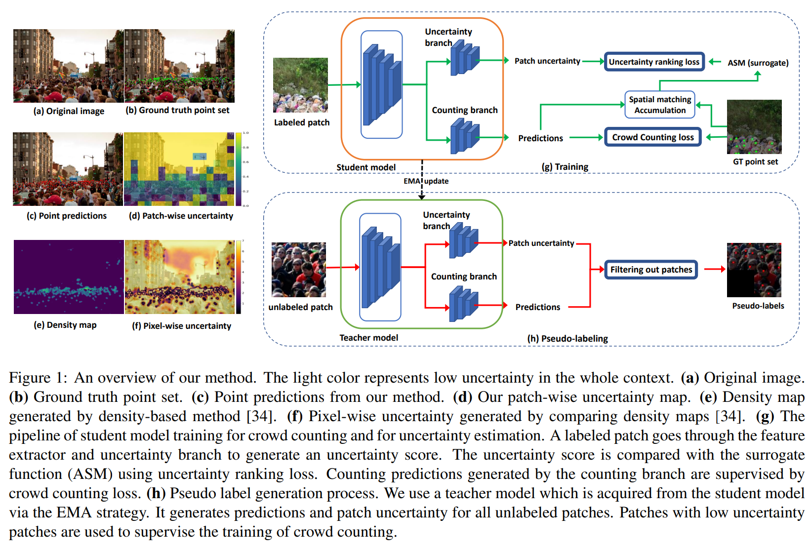

# Calibrating_Counting



## 1. Introduction

<!-- [ALGORITHM] -->

```BibTeX
@inproceedings{li2023calibrating,
  title={Calibrating uncertainty for semi-supervised crowd counting},
  author={Li, Chen and Hu, Xiaoling and Abousamra, Shahira and Chen, Chao},
  booktitle={2023 IEEE/CVF international conference on computer vision (ICCV)},
  pages={16685--16695},
  year={2023},
  organization={IEEE}
}
```

## 2. To install the environment, run the following script:
```shell
bash scripts/install.sh
```

## 3. To download the pretrained weight, run the following script:
```shell
bash scripts/download_weight.sh
```

## 4. To process the dataset, run the following script:
```shell
bash scripts/process_dataset.sh
```

## 5. To train and test the model for the ShanghaiTech dataset, run the following script:
```shell
bash scripts/train_sha.sh
```

## 6. Acknowledgement
* [superlc1995/Calibrating_count](https://github.com/superlc1995/Calibrating_count)
