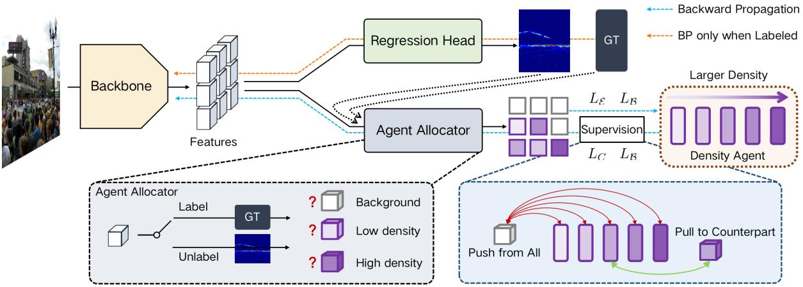

# DACount



## 1. Introduction

<!-- [ALGORITHM] -->

```BibTeX
@inproceedings{lin2022semi,
  title={Semi-supervised Crowd Counting via Density Agency},
  author={Lin, Hui and Ma, Zhiheng and Hong, Xiaopeng and Wang, Yaowei and Su, Zhou},
  booktitle={ACM Multimedia},
  year={2022}
}
```

## 2. To process the dataset, run the following script:
```shell
bash scripts/process_dataset.sh
```

## 3. To train and test the model for JHU-Crowd++ and UCF-QNRF datasets, run the following scripts:
```shell
bash scripts/train_jhu.sh
bash scripts/train_ucf.sh
bash scripts/test_jhu.sh
bash scripts/test_ucf.sh
```

## 4. Acknowledgement
* [LoraLinH/Semi-supervised-Crowd-Counting-via-Density-Agency](https://github.com/LoraLinH/Semi-supervised-Crowd-Counting-via-Density-Agency)
