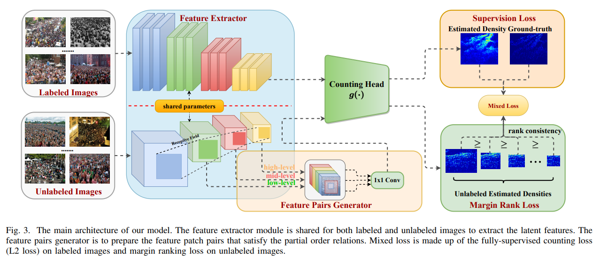

# DREAM



## 1. Introduction

<!-- [ALGORITHM] -->

```BibTeX
@article{gao2023deep,
  title={Deep rank-consistent pyramid model for enhanced crowd counting},
  author={Gao, Jiaqi and Huang, Zhizhong and Lei, Yiming and Shan, Hongming and Wang, James Z and Wang, Fei-Yue and Zhang, Junping},
  journal={IEEE Transactions on Neural Networks and Learning Systems},
  volume={36},
  number={1},
  pages={299--312},
  year={2023},
  publisher={IEEE}
}
```

## 2. To process the dataset, run the following script:
```shell
bash scripts/process_dataset.sh
```

## 3. To train and test the model for the ShanghaiTech dataset, run the following scripts:
```shell
bash scripts/train_sha.sh
bash scripts/test_sha.sh
```

## 4. Acknowledgement
* [bridgeqiqi/DREAM](https://github.com/bridgeqiqi/DREAM)
