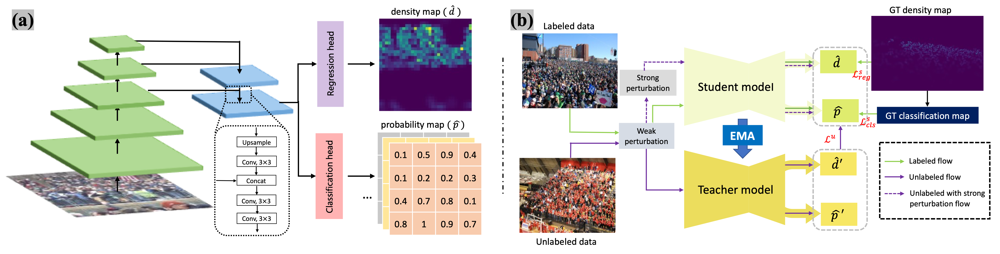

# MRC-Crowd



## 1. Introduction

<!-- [ALGORITHM] -->

```BibTeX
@ARTICLE{Semi2024Qian,
  author={Qian, Yifei and Hong, Xiaopeng and Guo, Zhongliang and Arandjelović, Ognjen and Donovan, Carl R.},
  journal={IEEE Transactions on Circuits and Systems for Video Technology}, 
  title={Semi-Supervised Crowd Counting With Contextual Modeling: Facilitating Holistic Understanding of Crowd Scenes}, 
  year={2024},
  volume={34},
  number={9},
  pages={8230-8241},
  doi={10.1109/TCSVT.2024.3392500}
}
```

## 2. To download the weight, run the following script:
```shell
bash scripts/download_weight.sh
```

## 3. To process the dataset, run the following scripts:
```shell
bash scripts/process_dataset.sh
```

## 4. To train and test the model for the ShanghaiTech dataset, run the following scripts:
```shell
bash scripts/train_sha.sh
bash scripts/train_shb.sh
bash scripts/test_sha.sh
bash scripts/test_shb.sh
```

## 5. Acknowledgement
* [cha15yq/MRC-Crowd](https://github.com/cha15yq/MRC-Crowd)
