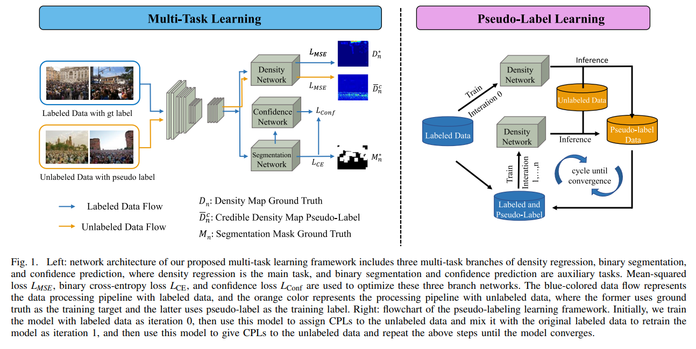

# MTCP



## 1. Introduction

<!-- [ALGORITHM] -->

```BibTeX
@article{zhu2023multi,
  title={Multi-task credible pseudo-label learning for semi-supervised crowd counting},
  author={Zhu, Pengfei and Li, Jingqing and Cao, Bing and Hu, Qinghua},
  journal={IEEE Transactions on Neural Networks and Learning Systems},
  volume={35},
  number={8},
  pages={10394--10406},
  year={2023},
  publisher={IEEE}
}
```

## 2. To download the pretrained weight, run the following script:
```shell
bash scripts/download_weight.sh
```

## 3. To process the dataset, run the following script:
```shell
bash scripts/process_dataset.sh
```

## 4. To train and test the model for the ShanghaiTech dataset, run the following scripts:
```shell
bash scripts/train_sha.sh
bash scripts/test_sha.sh
```

## 5. Acknowledgement
* [ljq2000/MTCP](https://github.com/ljq2000/MTCP)
