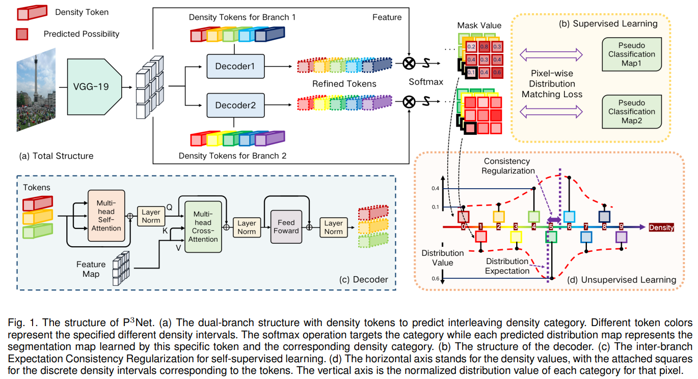

# P3Net



## 1. Introduction

<!-- [ALGORITHM] -->

```BibTeX
@article{lin2025semi,
  title={Semi-supervised Counting via Pixel-by-pixel Density Distribution Modelling},
  author={Lin, Hui and Ma, Zhiheng and Ji, Rongrong and Wang, Yaowei and Su, Zhou and Hong, Xiaopeng and Meng, Deyu},
  journal={IEEE Transactions on Pattern Analysis and Machine Intelligence},
  year={2025},
  publisher={IEEE}
}
```

## 2. To process the dataset, run the following script:
```shell
bash scripts/process_dataset.sh
```

## 3. To train and test the model for JHU-Crowd++ and UCF-QNRF datasets, run the following scripts:
```shell
bash scripts/train_jhu.sh
bash scripts/train_ucf.sh
bash scripts/test_jhu.sh
bash scripts/test_ucf.sh
```

## 4. Acknowledgement
* [LoraLinH/Semi-supervised-Counting-via-Pixel-by-pixel-Density-Distribution-Modelling](https://github.com/LoraLinH/Semi-supervised-Counting-via-Pixel-by-pixel-Density-Distribution-Modelling)
