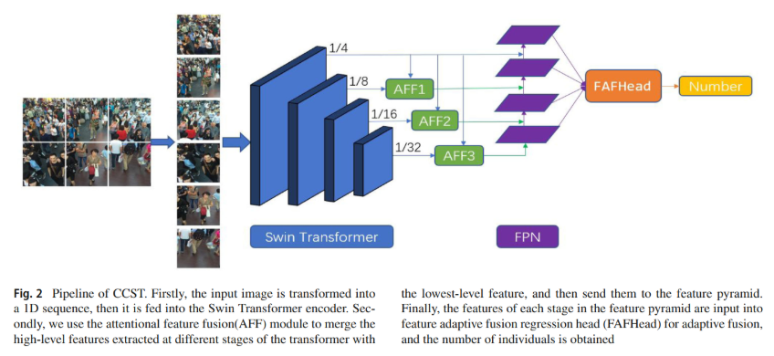

# CCST



## 1. Introduction

<!-- [ALGORITHM] -->

```BibTeX
@article{li2023ccst,
  title={CCST: crowd counting with swin transformer},
  author={Li, Bo and Zhang, Yong and Xu, Haihui and Yin, Baocai},
  journal={The Visual Computer},
  volume={39},
  number={7},
  pages={2671--2682},
  year={2023},
  publisher={Springer}
}
```

## 2. To test the model, run the following script:
```shell
bash scripts/test.sh
```

## 3. Acknowledgement
* [Boom5426/CCST-Crowd-Counting-with-Swin-Transformer](https://github.com/Boom5426/CCST-Crowd-Counting-with-Swin-Transformer)
