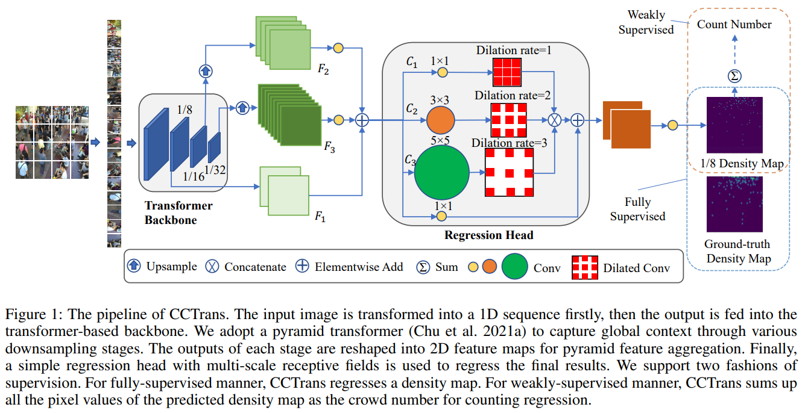

# CCTrans



## 1. Introduction

<!-- [ALGORITHM] -->

```BibTeX
@article{tian2021cctrans,
  title={CCTrans: Simplifying and improving crowd counting with transformer},
  author={Tian, Ye and Chu, Xiangxiang and Wang, Hongpeng},
  journal={arXiv preprint arXiv:2109.14483},
  year={2021}
}
```

## 2. To download the pretrained weight, run the following script:
```shell
bash scripts/download_weight.sh
```

## 3. To process the dataset, run the following script:
```shell
bash scripts/process_dataset.sh
```

## 4. To train, test, and visualize the model for ShanghaiTech dataset, run the following scripts:
```shell
bash scripts/train_sha.sh
bash scripts/train_shb.sh
bash scripts/test_sha.sh
bash scripts/test_shb.sh
bash scripts/vis_sha.sh
bash scripts/vis_shb.sh
```

## 5. Acknowledgement
* [wfs123456/CCTrans](https://github.com/wfs123456/CCTrans)
