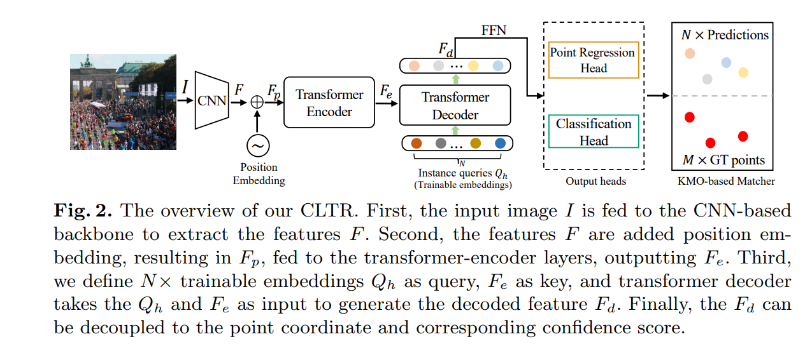

# CLTR



## 1. Introduction

<!-- [ALGORITHM] -->

```BibTeX
@inproceedings{carion2020end,
  title={End-to-end object detection with transformers},
  author={Carion, Nicolas and Massa, Francisco and Synnaeve, Gabriel and Usunier, Nicolas and Kirillov, Alexander and Zagoruyko, Sergey},
  booktitle={European conference on computer vision},
  pages={213--229},
  year={2020},
  organization={Springer}
}
```

## 2. To process the dataset, run the following script:
```shell
bash scripts/process_dataset.sh
```

## 3. To train, test, and infer the model for NWPU-Crowd and JHU-Crowd++, run the following scripts:
```shell
bash scripts/train_nwpu.sh
bash scripts/train_jhu.sh
bash scripts/test_nwpu.sh
bash scripts/test_jhu.sh
bash scripts/infer.sh
```

## 4. Acknowledgement
* [dk-liang/CLTR](https://github.com/dk-liang/CLTR)
