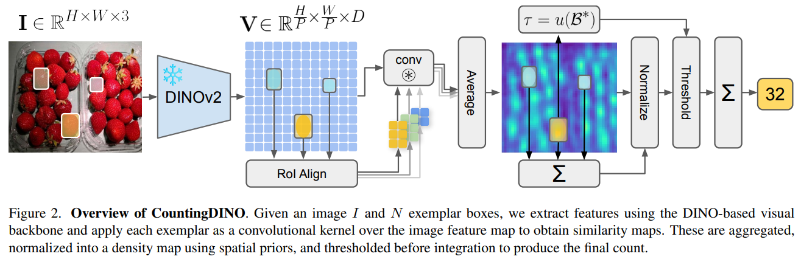

# CountingDINO



## 1. Introduction

<!-- [ALGORITHM] -->

```BibTeX
@inproceedings{pacini2026countingdino,
  title={Countingdino: A training-free pipeline for class-agnostic counting using unsupervised backbones},
  author={Pacini, Giacomo and Bianchi, Lorenzo and Ciampi, Luca and Messina, Nicola and Amato, Giuseppe and Falchi, Fabrizio},
  booktitle={Proceedings of the IEEE/CVF Winter Conference on Applications of Computer Vision},
  pages={806--815},
  year={2026}
}
```

## 2. To install the environment, run the following script:
```shell
bash scripts/install.sh
```

## 3. To download the dataset, run the following script:
```shell
bash scripts/download_dataset.sh
```

## 4. To download weights, run the following script:
```shell
bash scripts/download_weights.sh
```

## 5. To test the model for the FSC-147 dataset, run the following scripts:
```shell
bash scripts/test_baseline_fsc147.sh
bash scripts/test_cutler_fsc147.sh
```

## 6. Acknowledgement
* [lorebianchi98/CountingDINO](https://github.com/lorebianchi98/CountingDINO)
