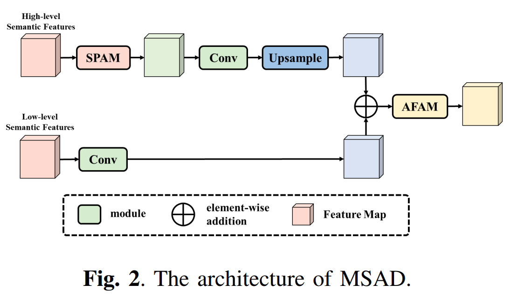

# EHNet



## 1. Introduction

<!-- [ALGORITHM] -->

```BibTeX
@article{yan2025ehnet,
  title={Ehnet: an efficient hybrid network for crowd counting and localization},
  author={Yan, Yuqing and Wu, Yirui},
  journal={arXiv preprint arXiv:2503.12061},
  year={2025}
}
```

## 2. To download pretrained weights, run the following script:
```shell
bash scripts/download_weights.sh
```

## 3. To train and test the model for the ShanghaiTech dataset, run the following scripts:
```shell
bash scripts/train_sha.sh
bash scripts/train_shb.sh
bash scripts/test_sha.sh
bash scripts/test_shb.sh
```

## 4. Acknowledgement
* [r/EHNet](https://anonymous.4open.science/r/EHNet)
