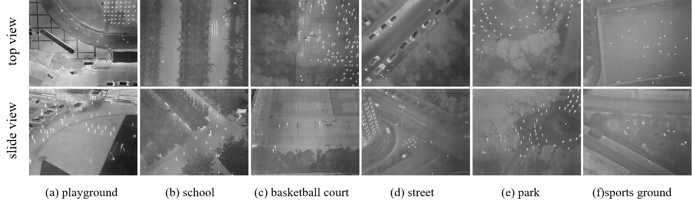

# IncepTNet



## 1. Introduction

<!-- [ALGORITHM] -->

```BibTeX
@article{wang2025large,
  title={A large-scale drone based thermal infrared benchmark and inception transformer network for crowd counting},
  author={Wang, Xing and Li, Timing and Liu, Ya and Yao, Shuanglong and Liu, Ye and Yang, Nan and Zhu, Pengfei},
  journal={Pattern Recognition},
  pages={112778},
  year={2025},
  publisher={Elsevier}
}
```

## 2. To install the environment, run the following script:
```shell
bash scripts/install.sh
```

## 3. To process the dataset, run the following script:
```shell
bash scripts/process_dataset.sh
```

## 4. To train and test the model for the ShanghaiTech dataset, run the following scripts:
```shell
bash scripts/train_sha.sh
bash scripts/test_sha.sh
```

## 5. Acknowledgement
* [TIMOLEEGO/IncepTNet](https://github.com/TIMOLEEGO/IncepTNet)
