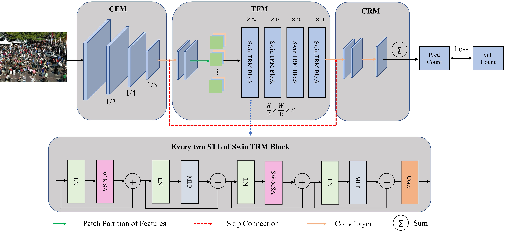

# JCTnet



## 1. Introduction

<!-- [ALGORITHM] -->

```BibTeX
@article{wang2022joint,
  title={Joint CNN and transformer network via weakly supervised learning for efficient crowd counting},
  author={Wang, Fusen and Liu, Kai and Long, Fei and Sang, Nong and Xia, Xiaofeng and Sang, Jun},
  journal={arXiv preprint arXiv:2203.06388},
  year={2022}
}
```

## 2. To process the dataset, run the following script:
```shell
bash scripts/process_dataset.sh
```

## 3. To train, test, and visualize the model for ShanghaiTech, UCF-QNRF, and NWPU-Crowd datasets, run the following scripts:
```shell
bash scripts/train_sha.sh
bash scripts/train_shb.sh
bash scripts/train_qnrf.sh
bash scripts/train_nwpu.sh
bash scripts/test_sha.sh
bash scripts/test_shb.sh
bash scripts/test_qnrf.sh
bash scripts/test_nwpu.sh
bash scripts/vis.sh
```

## 4. Acknowledgement
* [wfs123456/JCTnet](https://github.com/wfs123456/JCTnet)
