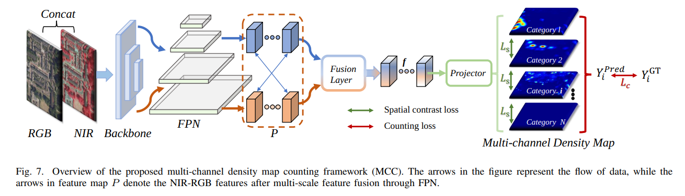

# NWPU-MOC



## 1. Introduction

<!-- [ALGORITHM] -->

```BibTeX
@ARTICLE{10410235,
  author={Gao, Junyu and Zhao, Liangliang and Li, Xuelong},
  journal={IEEE Transactions on Geoscience and Remote Sensing}, 
  title={NWPU-MOC: A Benchmark for Fine-grained Multi-category Object Counting in Aerial Images}, 
  year={2024},
  volume={},
  number={},
  pages={1-1},
  doi={10.1109/TGRS.2024.3356492}}
```

## 2. To download the pretrained weight, run the following script:
```shell
bash scripts/download_weight.sh
```

## 3. To train and test the model for the NWPU-MOC dataset, run the following scripts:
```shell
bash scripts/train_nwpu_moc.sh
bash scripts/test_nwpu_moc.sh
```

## 4. Acknowledgement
* [lyongo/NWPU-MOC](https://github.com/lyongo/NWPU-MOC)
