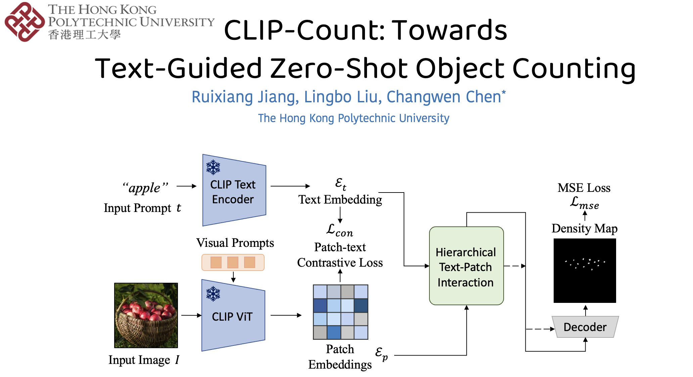

# CLIP-Count



## 1. Introduction

<!-- [ALGORITHM] -->

```BibTeX
@article{jiang2023clip,
  title={CLIP-Count: Towards Text-Guided Zero-Shot Object Counting},
  author={Jiang, Ruixiang and Liu, Lingbo and Chen, Changwen},
  journal={arXiv preprint arXiv:2305.07304},
  year={2023}
}
```

## 2. To install the environment, run the following script:
```shell
bash scripts/install.sh
```

## 3. To download the weight, run the following script:
```shell
bash scripts/download_weight.sh
```

## 4. To train, test, and demo the model for the FSC-147 dataset, run the following scripts:
```shell
bash scripts/train_fsc147.sh
bash scripts/test_fsc147.sh
bash scripts/demo_fsc147.sh
```

## 5. Acknowledgement
* [songrise/CLIP-Count](https://github.com/songrise/CLIP-Count)
