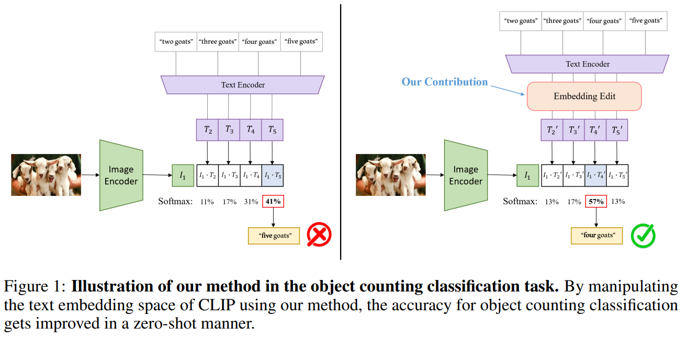

# CLIP_Counting



## 1. Introduction

<!-- [ALGORITHM] -->

```BibTeX
@inproceedings{zhang2023zero,
  title={Zero-shot improvement of object counting with CLIP},
  author={Zhang, Ruisu and Chen, Yicong and Lee, Kangwook},
  booktitle={R0-FoMo: Robustness of Few-shot and Zero-shot Learning in Large Foundation Models},
  year={2023}
}
```

## 2. To test the model for the ShanghaiTech dataset, run the following script:
```shell
bash scripts/test_sha.sh
```

## 3. Acknowledgement
* [UW-Madison-Lee-Lab/CLIP_Counting](https://github.com/UW-Madison-Lee-Lab/CLIP_Counting)
