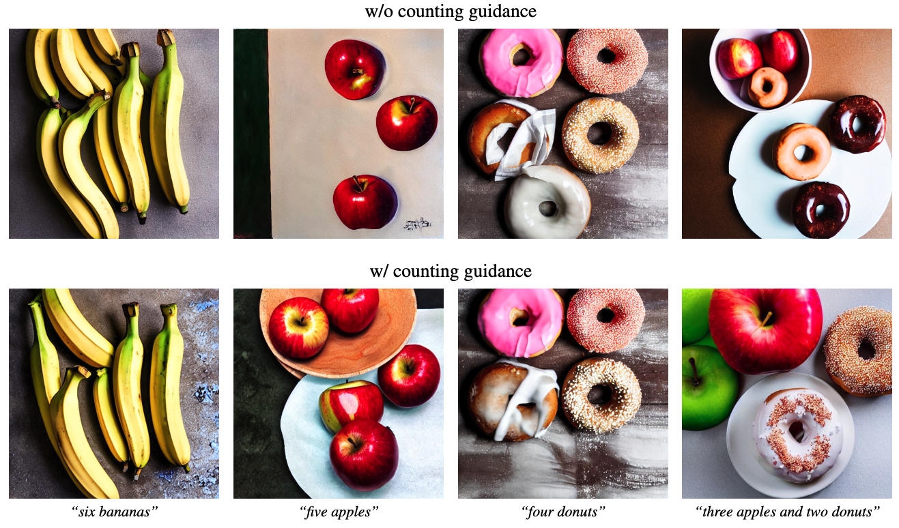

# Counting-Guidance



## 1. Introduction

<!-- [ALGORITHM] -->

```BibTeX
@inproceedings{kang2025counting,
  title={Counting guidance for high fidelity text-to-image synthesis},
  author={Kang, Wonjun and Galim, Kevin and Koo, Hyung Il and Cho, Nam Ik},
  booktitle={2025 IEEE/CVF Winter Conference on Applications of Computer Vision (WACV)},
  pages={899--908},
  year={2025},
  organization={IEEE}
}
```

## 2. To install the environment, run the following script:
```shell
bash scripts/install.sh
```

## 3. To download pretrained weights, run the following script:
```shell
bash scripts/download_weights.sh
```

## 4. To test the model, run the following script:
```shell
bash scripts/test.sh
```

## 5. Acknowledgement
* [furiosa-ai/counting-guidance](https://github.com/furiosa-ai/counting-guidance)
