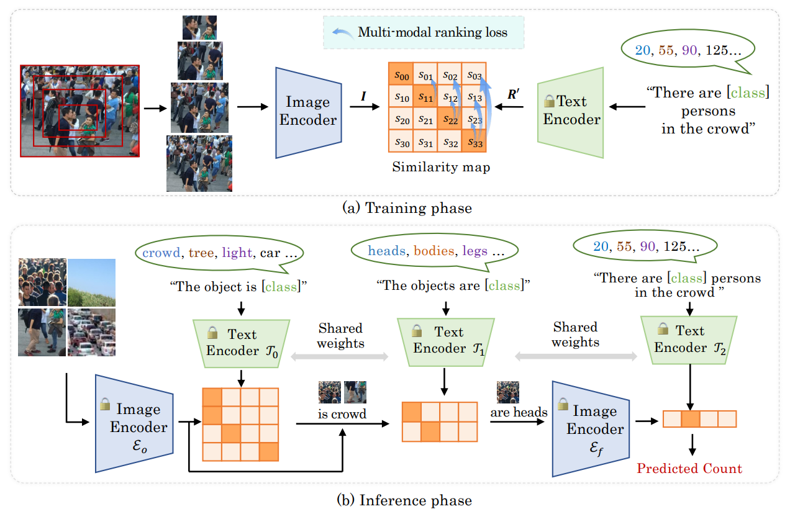

# CrowdCLIP



## 1. Introduction

<!-- [ALGORITHM] -->
```BibTeX
@article{Liang2023CrowdCLIP,
  title={CrowdCLIP: Unsupervised Crowd Counting via Vision-Language Model},
  author={Dingkang Liang, Jiahao Xie, Zhikang Zou, Xiaoqing Ye, Wei Xu, Xiang Bai},
  journal={CVPR},
  year={2023}
}
```

## 2. To install the environment, run the following script:
```shell
bash scripts/install.sh
```

## 3. To process the dataset, run the following script:
```shell
bash scripts/process_dataset.sh
```

## 4. To train and test the model for ShanghaiTech and UCF-QNRF datasets, run the following scripts:
```shell
bash scripts/train_sha.sh
bash scripts/train_shb.sh
bash scripts/train_qnrf.sh
bash scripts/test_sha.sh
bash scripts/test_shb.sh
bash scripts/test_qnrf.sh
```

## 5. Acknowledgement
* [dk-liang/CrowdCLIP](https://github.com/dk-liang/CrowdCLIP)
