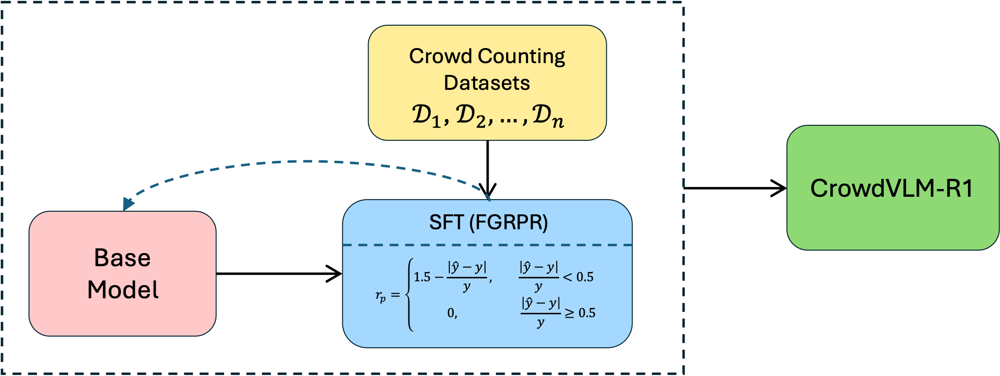

# CrowdVLM-R1



## 1. Introduction

<!-- [ALGORITHM] -->

```BibTeX
@misc{wang2025crowdvlmr1expandingr1ability,
      title={CrowdVLM-R1: Expanding R1 Ability to Vision Language Model for Crowd Counting using Fuzzy Group Relative Policy Reward}, 
      author={Zhiqiang Wang and Pengbin Feng and Yanbin Lin and Shuzhang Cai and Zongao Bian and Jinghua Yan and Xingquan Zhu},
      year={2025},
      eprint={2504.03724},
      archivePrefix={arXiv},
      primaryClass={cs.CV},
      url={https://arxiv.org/abs/2504.03724}, 
}
```

## 2. To install the environment, run the following script:
```shell
bash scripts/install.sh
```

## 3. To download the dataset, run the following script:
```shell
bash scripts/download_dataset.sh
```

## 4. To train and test the model for the CrowdVLM dataset, run the following script:
```shell
bash scripts/train_crowdvlm.sh
```

## 5. Acknowledgement
* [yeyimilk/CrowdVLM-R1](https://github.com/yeyimilk/CrowdVLM-R1)
