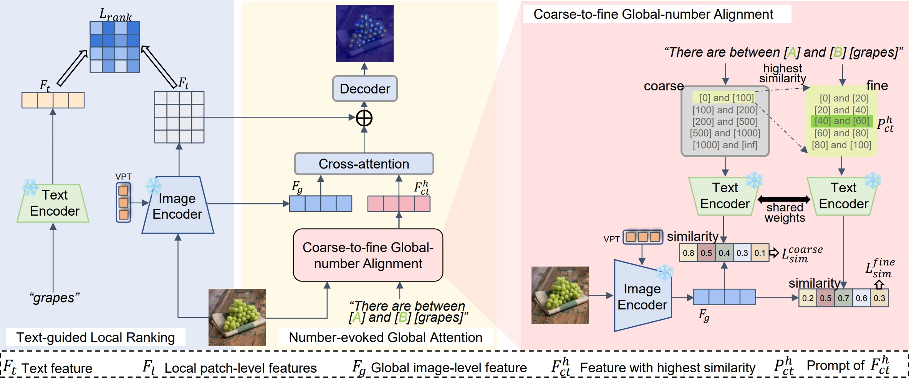

# LGCount



## 1. Introduction

<!-- [ALGORITHM] -->

```BibTeX
@inproceedings{zhang2025enhancing,
  title={Enhancing Zero-shot Object Counting via Text-guided Local Ranking and Number-evoked Global Attention},
  author={Zhang, Shiwei and Zhou, Qi and Ke, Wei},
  booktitle={Proceedings of the IEEE/CVF International Conference on Computer Vision},
  pages={21097--21106},
  year={2025}
}
```

## 2. To install the environment, run the following script:
```shell
bash scripts/install.sh
```

## 3. To download the weight, run the following script:
```shell
bash scripts/download_weight.sh
```

## 4. To train and test the model for the FSC-147 dataset, run the following scripts:
```shell
bash scripts/train_fsc147.sh
bash scripts/test_fsc147.sh
```

## 5. Acknowledgement
* [zaqai/LGCount](https://github.com/zaqai/LGCount)
