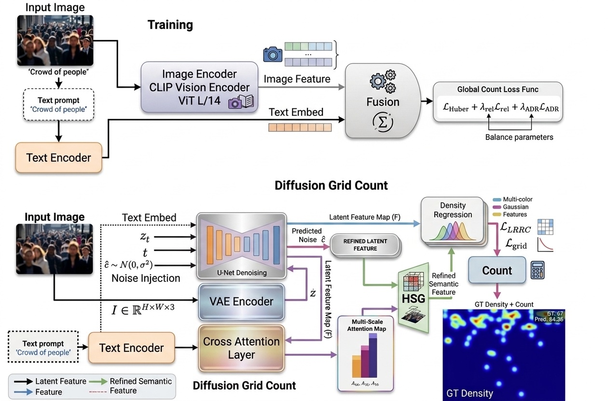

# RVL_DiffGrid



## 1. Introduction

<!-- [ALGORITHM] -->

```BibTeX
@misc{githubGitHubMasnurul17RVL_DiffGrid,
	author = {},
	title = {{G}it{H}ub - {M}asnurul17/{R}{V}{L}\_{D}iff{G}rid: {O}fficial {P}y{T}orch implementation of {R}{V}{L}-{D}iff{G}rid ({I}{E}{E}{E} {I}{C}{M}{E} 2026): a diffusion-enhanced vision-language framework for crowd counting with {H}ierarchical {S}emantic {G}rids ({H}{S}{G}). --- github.com},
	howpublished = {\url{https://github.com/{M}asnurul17/{R}{V}{L}\_{D}iff{G}rid}},
	year = {},
	note = {[Accessed 24-06-2026]},
}
```

## 2. To install the environment, run the following script:
```shell
bash scripts/install.sh
```

## 3. To process the dataset, run the following script:
```shell
bash scripts/process_dataset.sh
```

## 4. To train and test the model for the ShanghaiTech dataset, run the following scripts:
```shell
bash scripts/train_sha.sh
bash scripts/train_shb.sh
bash scripts/test_sha.sh
bash scripts/test_shb.sh
```

## 5. Acknowledgement
* [Masnurul17/RVL_DiffGrid](https://github.com/Masnurul17/RVL_DiffGrid)
