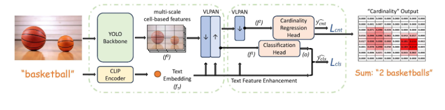

# YOLO-Count



## 1. Introduction

<!-- [ALGORITHM] -->

```BibTeX
@InProceedings{zeng2025yolocount,
    author    = {Zeng, Guanning and Zhang, Xiang and Wang, Zirui and Xu, Haiyang and Chen, Zeyuan and Li, Bingnan and Tu, Zhuowen},
    title     = {YOLO-Count: Differentiable Object Counting for Text-to-Image Generation},
    booktitle = {Proceedings of the IEEE/CVF International Conference on Computer Vision (ICCV)},
    month     = {October},
    year      = {2025},
    pages     = {16765--16775}
}
```

## 2. To install the environment, run the following script:
```shell
bash scripts/install.sh
```

## 3. To download the dataset, run the following script:
```shell
bash scripts/download_dataset.sh
```

## 4. To download weights, run the following script:
```shell
bash scripts/download_weights.sh
```

## 5. To test the model for the FSC-147 dataset, run the following script:
```shell
bash scripts/test_fsc147.sh
```

## 6. Acknowledgement
* [mlpc-ucsd/YOLO-Count](https://github.com/mlpc-ucsd/YOLO-Count)
