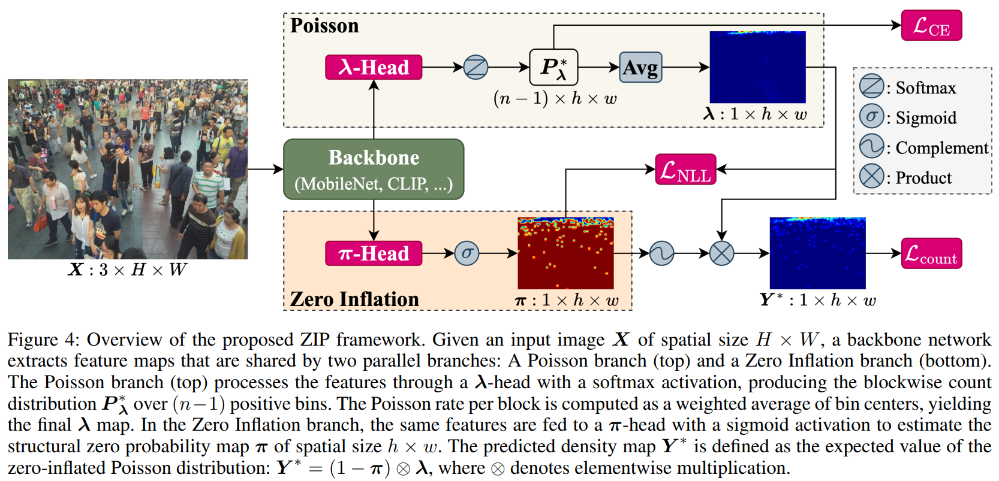

# ZIP



## 1. Introduction

<!-- [ALGORITHM] -->

```BibTeX
@article{ma2025zip,
  title={ZIP: Scalable Crowd Counting via Zero-Inflated Poisson Modeling},
  author={Ma, Yiming and Sanchez, Victor and Guha, Tanaya},
  journal={arXiv preprint arXiv:2506.19955},
  year={2025}
}
```

## 2. To install the environment, run the following script:
```shell
bash scripts/install.sh
```

## 3. To download the dataset, run the following script:
```shell
bash scripts/download_dataset.sh
```

## 4. To download weights, run the following script:
```shell
bash scripts/download_weights.sh
```

## 5. To train and test the model for ShanghaiTech, UCF-QNRF, and NWPU-Crowd datasets, run the following scripts:
```shell
bash scripts/train_sha.sh
bash scripts/train_shb.sh
bash scripts/train_qnrf.sh
bash scripts/train_nwpu.sh
bash scripts/test_sha.sh
bash scripts/test_shb.sh
bash scripts/test_qnrf.sh
bash scripts/test_nwpu.sh
```

## 6. Acknowledgement
* [Yiming-M/ZIP](https://github.com/Yiming-M/ZIP)
