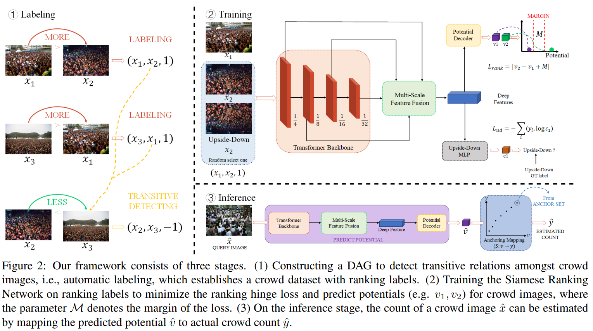

# CCRanking



## 1. Introduction

<!-- [ALGORITHM] -->

```BibTeX
@inproceedings{xiong2024glance,
  title={Glance to count: Learning to rank with anchors for weakly-supervised crowd counting},
  author={Xiong, Zheng and Chai, Liangyu and Liu, Wenxi and Liu, Yongtuo and Ren, Sucheng and He, Shengfeng},
  booktitle={Proceedings of the IEEE/CVF Winter Conference on Applications of Computer Vision},
  pages={343--352},
  year={2024}
}
```

## 2. To process the dataset, run the following script:
```shell
bash scripts/process_dataset.sh
```

## 3. To train and test the model for the ShanghaiTech dataset, run the following script:
```shell
bash scripts/train_sha.sh
```

## 4. Acknowledgement
* [pandaszzzzz/CCRanking](https://github.com/pandaszzzzz/CCRanking)
