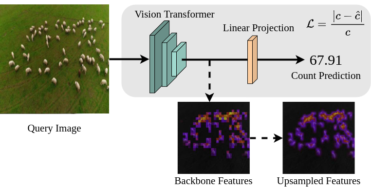

# LearningToCountAnything



## 1. Introduction

<!-- [ALGORITHM] -->

```BibTeX
@article{hobley2022-LTCA,
        title={Learning to Count Anything: Reference-less Class-agnostic Counting with Weak Supervision},
        author={Hobley, Michael and Prisacariu, Victor},
        journal = {Proceedings of the {IEEE} Conference on Computer Vision and Pattern Recognition ({CVPR})},
        year={2023}
}
```

## 2. To install the environment, run the following script:
```shell
bash scripts/install.sh
```

## 3. To download the dataset, run the following script:
```shell
bash scripts/download_dataset.sh
```

## 4. To train, test, and visualize the model for the FSC-133 dataset, run the following scripts:
```shell
bash scripts/train_fsc133.sh
bash scripts/test_fsc133.sh
bash scripts/vis_fsc133.sh
```

## 5. Acknowledgement
* [ActiveVisionLab/LearningToCountAnything](https://github.com/ActiveVisionLab/LearningToCountAnything)
