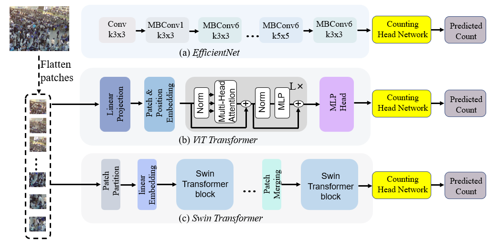

# WSCC_TAF



## 1. Introduction

<!-- [ALGORITHM] -->

```BibTeX
@inproceedings{wang2024weakly,
  title={Weakly-Supervised Crowd Counting with Token Attention and Fusion: A Simple and Effective Baseline},
  author={Wang, Yi and Hu, Qiongyang and Chau, Lap-Pui},
  booktitle={ICASSP 2024-2024 IEEE International Conference on Acoustics, Speech and Signal Processing (ICASSP)},
  pages={13456--13460},
  year={2024},
  organization={IEEE}
}
```

## 2. To install the environment, run the following script:
```shell
bash scripts/install.sh
```

## 3. To download pretrained weights, run the following script:
```shell
bash scripts/download_weights.sh
```

## 4. To process the dataset, run the following script:
```shell
bash scripts/process_dataset.sh
```

## 5. To train and test the model for the ShanghaiTech dataset, run the following scripts:
```shell
bash scripts/train_sha.sh
bash scripts/train_shb.sh
```

## 6. Acknowledgement
* [WangyiNTU/WSCC_TAF](https://github.com/WangyiNTU/WSCC_TAF)
