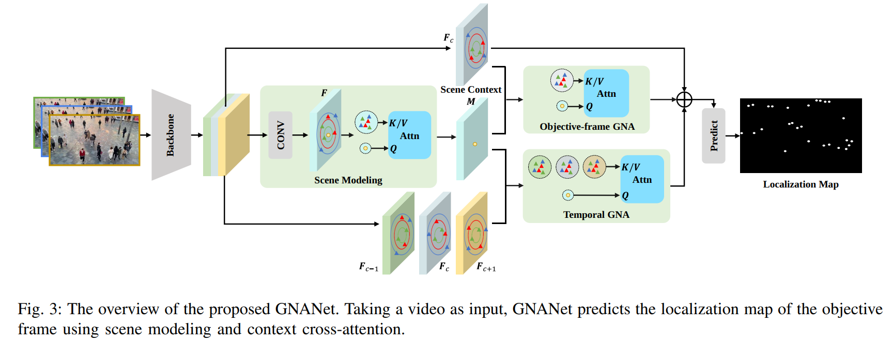

# VSCrowd



## 1. Introduction

<!-- [ALGORITHM] -->

```BibTeX
@article{li2022video,
  title={Video Crowd Localization With Multifocus Gaussian Neighborhood Attention and a Large-Scale Benchmark},
  author={Li, Haopeng and Liu, Lingbo and Yang, Kunlin and Liu, Shinan and Gao, Junyu and Zhao, Bin and Zhang, Rui and Hou, Jun},
  journal={IEEE Transactions on Image Processing},
  volume={31},
  pages={6032--6047},
  year={2022},
  publisher={IEEE}
}
```

## 2. To process the dataset, run the following script:
```shell
bash scripts/process_dataset.sh
```

## 3. To convert the dataset to the yolo format, run the following script:
```shell
bash scripts/convert.sh
```

## 4. Acknowledgement
* [HopLee6/VSCrowd-Dataset](https://github.com/HopLee6/VSCrowd-Dataset)
